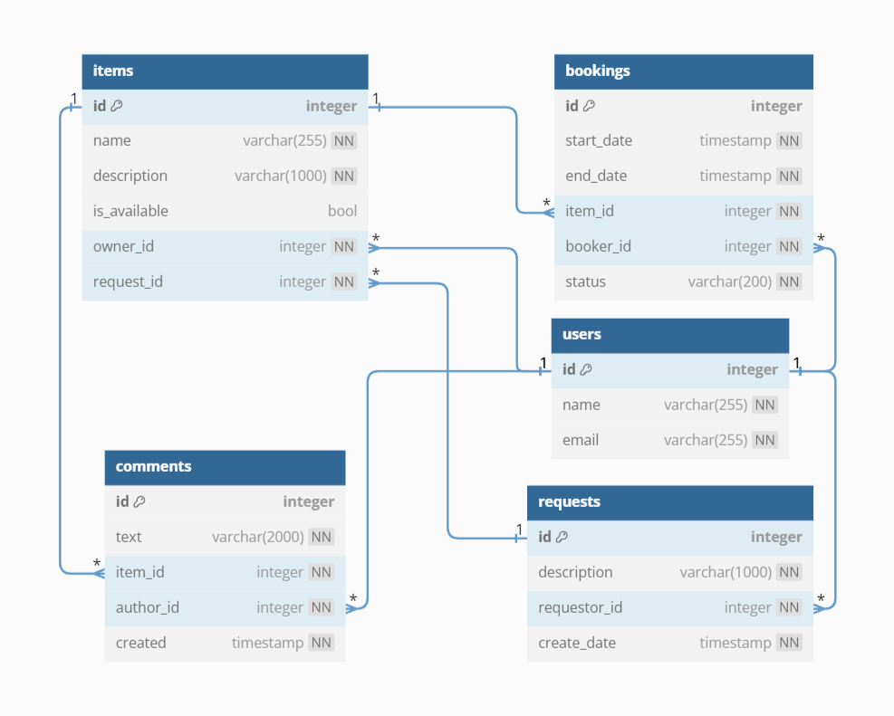

# ShareIt
Приложение, в котором пользователи могут давать или брать в аренду какие-то вещи, а так же оставлять запросы на них. 
Оно состоит из двух микросервисов: основного и сервиса, которое отвечает за валидацию входных данных и перенаправляет 
запросы в основной сервис при помощи HttpClient.

_**Используемый стэк**_: Spring Boot, JUnit, RestTemplate, Hibernate, Maven, SQL, PostgreSQL, Postman, Git, DBeaver  

## Функциональность

В приложении присутствуют 2 сервиса. Основной сервис и сервис, в котором происходит валидация запросов пользователей.  

### shareIt-server (Основной сервис)
Основной сервис (shareIt-server) представляет собой, своего рода, доску объявлений.
В нём пользователи могут искать вещи для аренды или выставлять свои.  

Ниже приведён обобщённый список с функциями:
- Добавление, удаление и просмотр пользователей;
- Добавление, изменение и просмотр вещей;
- Получение списка всех своих вещей;
- Поиск вещей с возможностью фильтрации и пагинации;
- Добавление бронирований вещей;
- Одобрение или отклонение бронирований владельцем вещи;
- Получение списков своих бронирований, а также бронирований своих вещей;
- Возможность оставлять комментарии к вещам после их бронирований;
- Добавление запросов на бронирование вещей, которых ещё нет в доступе;
- Добавление вещей для бронирований на основе сделанных запросов.  

## Схемы баз данных
### shareIt-server

